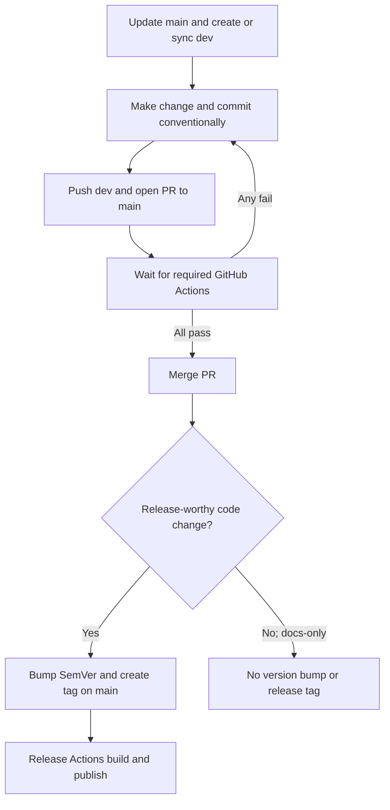
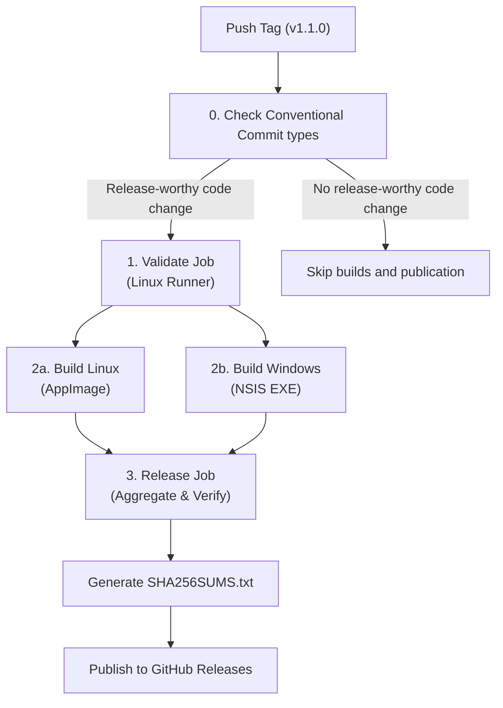

# Release & Versioning Guide

This document outlines the official versioning policy, release preparation process, and automated cross-platform release pipeline for **RT-Library**.

---

## 1. Semantic Versioning Policy

RT-Library adheres strictly to [Semantic Versioning 2.0.0](https://semver.org/) (`MAJOR.MINOR.PATCH`):

- **MAJOR**: Incompatible architectural changes, major database schema rewrites requiring manual migration, or breaking IPC contract modifications.
- **MINOR**: New user-facing features, additional platform support, new themes, or new subforum category extractors added in a backwards-compatible manner.
- **PATCH**: Backwards-compatible bug fixes, security patches, styling/accessibility tweaks, and performance optimizations.

Release tags follow the format:
```
vMAJOR.MINOR.PATCH
```
Example: `v1.0.0`, `v1.1.0`, `v1.0.1`.

### Release eligibility from Conventional Commits

Application releases are created for release-worthy code changes since the previous release:

- `feat` triggers a MINOR release.
- `fix`, `perf`, or `revert` triggers a PATCH release.
- A non-documentation breaking change marked with `!` or a `BREAKING CHANGE:` footer triggers a MAJOR release.
- A documentation-only change uses `docs:`. It does not bump the application version or create a release tag. `test`, `ci`, and maintenance-only commits do not trigger a release by themselves.

The release workflow checks commits between the current tag and the previous release tag. If it finds no release-worthy Conventional Commit, it skips validation builds and publication. Documentation-only work still goes through the normal Pull Request checks and merge flow.

---

## 2. Development and Release Preparation Workflow

Every code or documentation change follows the project workflow: start from `main`, work on the `dev` branch, commit with Conventional Commits, open a Pull Request to `main`, wait for GitHub Actions, and merge only after all required checks pass. If `dev` is absent, create it from the latest `main`. Keep `dev` synchronized with `main` after each merge. Only release-worthy code changes need a version bump and release tag.



### Step 1: Prepare a code release on `dev`

Use this process only when the commits since the previous release include a release-worthy code change. For a documentation-only change, use a `docs:` commit and do not update the application version, create a release tag, or run the release preparation helper.

For a code release, start from an up-to-date `dev` branch. Choose the next version according to the SemVer policy above. Use the release preparation helper to update `package.json` and `package-lock.json` without creating a tag:
```bash
npm run release:prepare 1.1.0
```

Edit `CHANGELOG.md` with the release date and notes:
```markdown
## [1.1.0] - YYYY-MM-DD

### Added
- Feature description...

### Fixed
- Bug fix description...
```

### Step 2: Validate and commit

Run the local checks before opening the Pull Request:
```bash
npm test
npm run build
npm run audit:licenses
npm run release:check
npm run release:validate v1.1.0
```

Commit the version and changelog changes on `dev` using a Conventional Commit message:
```bash
git add package.json package-lock.json CHANGELOG.md
git commit -m "chore(release): v1.1.0"
git push -u origin dev
```

Open a Pull Request from `dev` to `main`. Wait for every required GitHub Actions check to pass; fix failures on `dev`, push the fix, and wait for the checks again. Merge only after all required checks pass.

### Step 3: Tag the merged release

After the Pull Request is merged, update local `main` and confirm the release version is there:
```bash
git switch main
git pull --ff-only origin main
npm run release:validate v1.1.0
git tag -a v1.1.0 -m "Release v1.1.0"
git push origin v1.1.0
```

Pushing the tag starts the release workflow. Do not push release version changes directly to `main` or create the tag before those changes pass the Pull Request Actions and merge.

---

## 3. Automated GitHub Actions Pipeline

When a tag matching `v*.*.*` is pushed, `.github/workflows/release.yml` checks the Conventional Commit types since the previous release tag. It runs validation, packaging, and publication only when it finds a release-worthy code change; otherwise, those jobs are skipped.



### Pipeline Jobs & Guarantees:
0. **`release-eligibility`**: Scans commits since the previous release tag. Only `feat`, `fix`, `perf`, `revert`, or non-documentation breaking changes enable the release jobs.
1. **`validate` Gate**: Runs on `ubuntu-latest` when the eligibility gate passes. Executes the test suite, frontend compilation, license audit, release readiness scan, and SemVer tag consistency check. If any check fails, packaging jobs do not start.
2. **`build-linux`**: Runs on `ubuntu-latest`. Compiles native `better-sqlite3` for Linux, packages the desktop AppImage, and verifies archive runtime integrity (`npm run package:verify`).
3. **`build-windows`**: Runs on native `windows-latest`. Compiles native `better-sqlite3` for Windows x64 and generates the NSIS setup installer (`.exe`).
4. **`release`**: Runs on `ubuntu-latest` after both builds succeed:
   - Downloads all compiled binary artifacts.
   - Strictly verifies that only the expected binaries (1 AppImage and 1 NSIS EXE) exist.
   - Computes `SHA256SUMS.txt` cryptographic hashes.
   - Deploys the release assets and release notes directly to GitHub Releases.

---

## 4. Release Artifacts & Checksums

Each public release publishes:
1. **Linux AppImage**: `RT-Library-${VERSION}-linux-x86_64.AppImage`
2. **Windows Installer**: `RT-Library-${VERSION}-windows-x64-setup.exe`
3. **Integrity Checksums**: `SHA256SUMS.txt`

### Verifying Checksums
Users can verify the authenticity and integrity of downloaded binaries:
```bash
# On Linux
sha256sum -c SHA256SUMS.txt

# On Windows (PowerShell)
Get-FileHash -Algorithm SHA256 RT-Library-*-windows-x64-setup.exe
```

---

## 5. Security & Signing Notes

- **Least Privilege Permissions**: CI workflows run with `contents: read`. Only the final deployment step in `release.yml` uses scoped `contents: write`.
- **Fork Safety**: Pull requests from forks are executed in read-only mode without access to release tokens or repository write permissions.
- **Windows Code Signing**: Windows executables are currently built without an EV Code Signing certificate (`WINDOWS_CODE_SIGNING: NOT CONFIGURED`). Users may see a standard Windows SmartScreen prompt upon first launch.
