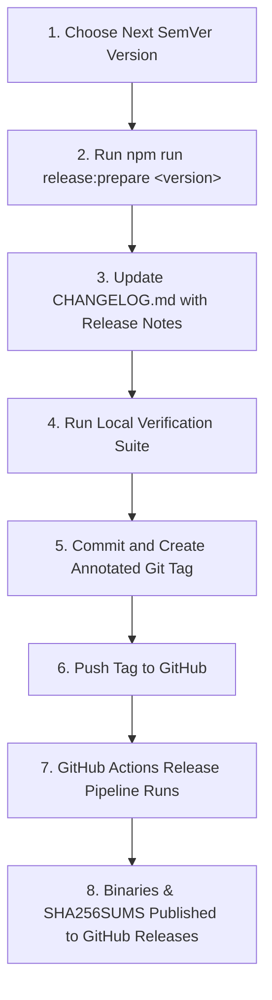
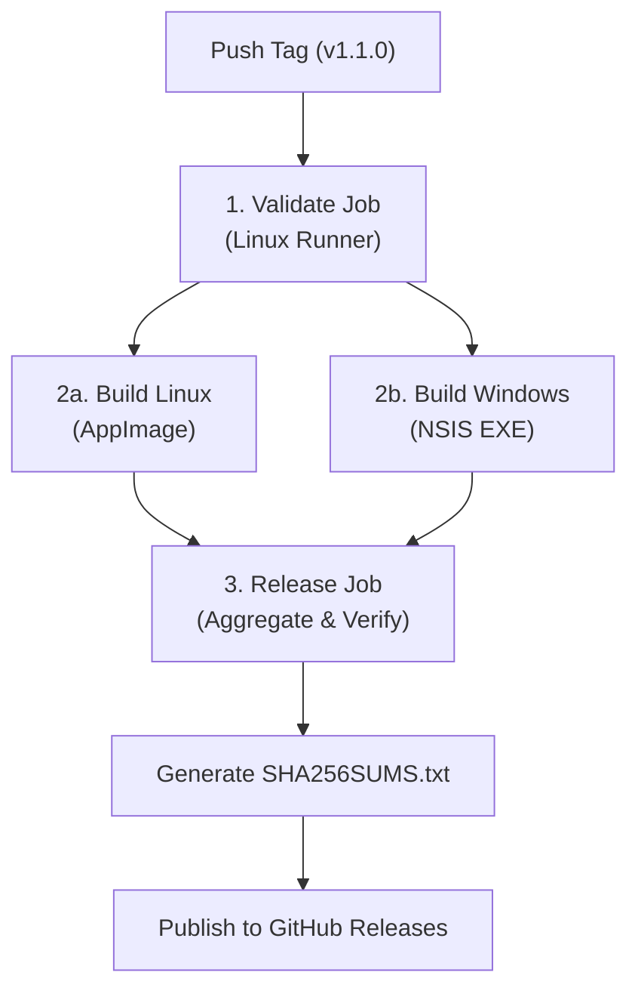

# Release & Versioning Guide

This document outlines the official versioning policy, release preparation process, and automated cross-platform release pipeline for **RT-Library**.

---

## 1. Semantic Versioning Policy

RT-Library adheres strictly to [Semantic Versioning 2.0.0](https://semver.org/) (`MAJOR.MINOR.PATCH`):

- **MAJOR**: Incompatible architectural changes, major database schema rewrites requiring manual migration, or breaking IPC contract modifications.
- **MINOR**: New user-facing features, additional platform support, new themes, or new subforum category extractors added in a backwards-compatible manner.
- **PATCH**: Backwards-compatible bug fixes, security patches, styling/accessibility tweaks, and performance optimizations.

Release tags follow the format:
```
vMAJOR.MINOR.PATCH
```
Example: `v1.0.0`, `v1.1.0`, `v1.0.1`.

---

## 2. Release Preparation Workflow (Maintainer)

All release preparation is performed locally before creating any Git tag.



### Step 1: Synchronize Version
Use the release preparation helper script to update `package.json` and `package-lock.json` synchronously without creating Git tags:
```bash
npm run release:prepare 1.1.0
```

### Step 2: Update Changelog
Edit `CHANGELOG.md` to add a new section header with the current release date:
```markdown
## [1.1.0] - 2026-10-15

### Added
- Feature description...

### Fixed
- Bug fix description...
```

### Step 3: Run Local Validation Suite
Execute the full automated verification checklist before committing:
```bash
# 1. Run unit, integration, and contrast tests
npm test

# 2. Verify TypeScript typechecking and production Vite bundle
npm run build

# 3. Verify third-party license audit
npm run audit:licenses

# 4. Verify release privacy scanner (zero secrets, databases, or scraped data)
npm run release:check

# 5. Validate SemVer consistency
npm run release:validate v1.1.0
```

### Step 4: Commit and Create Tag Manually
Once all local checks pass, the maintainer commits the version updates and creates an annotated tag:
```bash
git add package.json package-lock.json CHANGELOG.md
git commit -m "chore(release): v1.1.0"
git tag -a v1.1.0 -m "Release v1.1.0"
```

### Step 5: Push to Trigger Automated Release
Pushing the tag to GitHub initiates the automated CI/CD release workflow:
```bash
git push origin main
git push origin v1.1.0
```

---

## 3. Automated GitHub Actions Pipeline

When a tag matching `v*.*.*` is pushed, the `.github/workflows/release.yml` workflow triggers:



### Pipeline Jobs & Guarantees:
1. **`validate` Gate**: Runs on `ubuntu-latest`. Executes test suite, frontend compilation, license audit, release readiness scan, and SemVer tag consistency check. If any check fails, packaging jobs never start.
2. **`build-linux`**: Runs on `ubuntu-latest`. Compiles native `better-sqlite3` for Linux, packages the desktop AppImage, and verifies archive runtime integrity (`npm run package:verify`).
3. **`build-windows`**: Runs on native `windows-latest`. Compiles native `better-sqlite3` for Windows x64 and generates the NSIS setup installer (`.exe`).
4. **`release`**: Runs on `ubuntu-latest` after both builds succeed:
   - Downloads all compiled binary artifacts.
   - Strictly verifies that only the expected binaries (1 AppImage and 1 NSIS EXE) exist.
   - Computes `SHA256SUMS.txt` cryptographic hashes.
   - Deploys the release assets and release notes directly to GitHub Releases.

---

## 4. Release Artifacts & Checksums

Each public release publishes:
1. **Linux AppImage**: `RT-Library-${VERSION}-linux-x86_64.AppImage`
2. **Windows Installer**: `RT-Library-${VERSION}-windows-x64-setup.exe`
3. **Integrity Checksums**: `SHA256SUMS.txt`

### Verifying Checksums
Users can verify the authenticity and integrity of downloaded binaries:
```bash
# On Linux
sha256sum -c SHA256SUMS.txt

# On Windows (PowerShell)
Get-FileHash -Algorithm SHA256 RT-Library-*-windows-x64-setup.exe
```

---

## 5. Security & Signing Notes

- **Least Privilege Permissions**: CI workflows run with `contents: read`. Only the final deployment step in `release.yml` uses scoped `contents: write`.
- **Fork Safety**: Pull requests from forks are executed in read-only mode without access to release tokens or repository write permissions.
- **Windows Code Signing**: Windows executables are currently built without an EV Code Signing certificate (`WINDOWS_CODE_SIGNING: NOT CONFIGURED`). Users may see a standard Windows SmartScreen prompt upon first launch.

